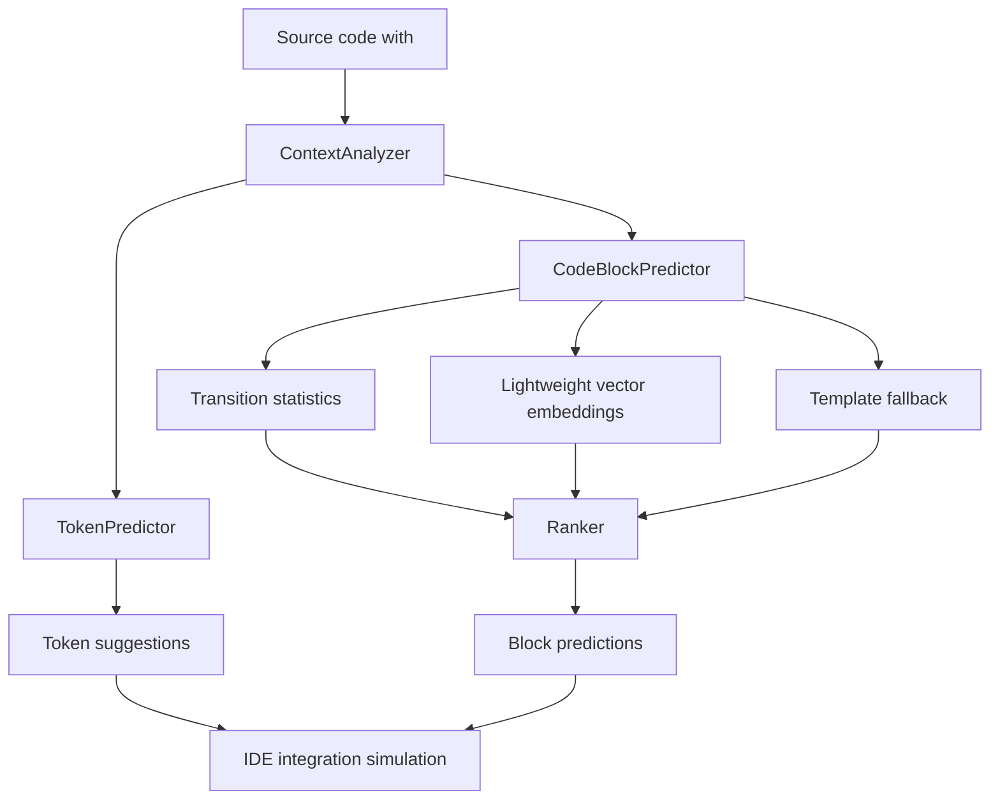
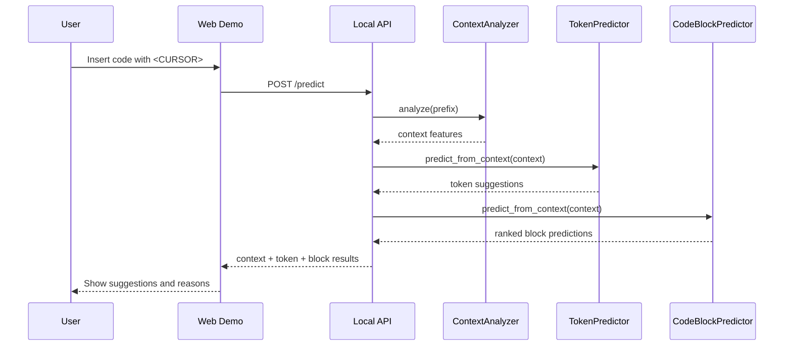
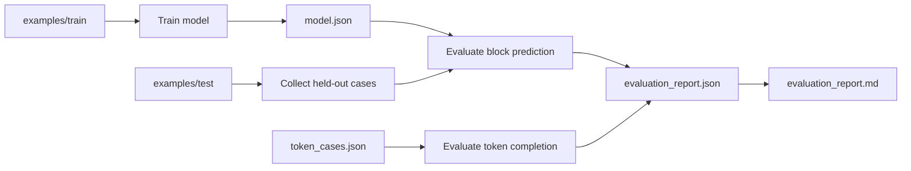

# Architecture

## System Overview

## Prediction Pipeline

## Evaluation Pipeline

## Main Signals Used By The Ranker

| Signal | Purpose |
|---|---|
| previous block signature | captures local code sequence |
| scope kind | separates module/function/class/loop contexts |
| token overlap | boosts candidates using same identifiers |
| lightweight embeddings | compares semantic similarity of code fragments |
| special context variables | boosts `result`, `total`, `count`, `self.*` cases |
| template fallback | handles incomplete IDE-style code |

## Notes

The project uses lightweight hashed TF-IDF vector embeddings. The architecture keeps this module isolated, so it can later be replaced with CodeBERT, CodeT5, or another HuggingFace model.
